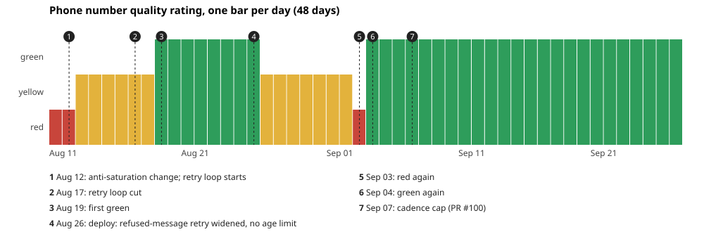
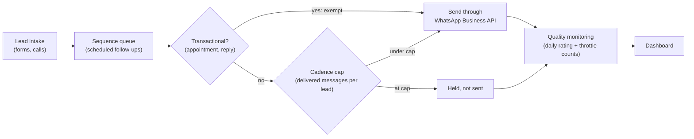

# messaging-account-recovery-case-study: keeping a WhatsApp Business number healthy

A case study of a sales CRM's WhatsApp number over 48 days (2026-08-11 to 2026-09-27): how its
quality rating fell, what was changed, what can and cannot be claimed about why it recovered,
and a monitor designed from what happened.

> **Scope.** The only real data here is the provider's daily quality rating
> (`data/quality_series.csv`: date and rating, nothing else). No message text, no phone numbers,
> no customer data. Every other series in this repo is synthetic and marked as such.



48 days: **32 green, 13 yellow, 3 red.** Since Sep 4 the rating has been **green 24 days in a
row** (to Sep 27). That recovery does not coincide with any change made in this project, so it
is not claimed as a result.

## How messages reach the number



## The arc

**1. A retry loop (Aug 12–17).** A change to the anti-saturation logic on Aug 12 left the
system attempting the same automated messages over and over. The CRM's own throttle stopped
almost all of those attempts, so they never reached the provider.

**Open question:** the rating was already **red on Aug 11**, the day before that change. The
loop cannot explain the first red day, and nothing in the available data does.

**2. The loop is cut (Aug 17).** Blocked attempts fell right after the cut.

**3. Green (Aug 19–26).** The rating went yellow, then green. **It is not proven that cutting
the loop is what recovered it.** The blocked attempts never reached the provider, so they could
not lower the rating by themselves. If loop and rating are related, it is through a common
cause, not directly.

**4. Relapse (Aug 27 – Sep 3).** The rating went yellow the day after a deploy on Aug 26, and
red on Sep 3. **The strongest candidate is the retry queue that deploy released:** it began
storing provider-refused messages and scheduling them again, and throttle blocks jumped that
night across many more phones than usual. It is a candidate, not a proof: the evidence is
timing and shape, not code.

**5. Green again (Sep 4 onwards)**, with no change of this project on that day.

**6. Prevention: a cadence cap (PR #100, Sep 7).** Follow-ups now stop after a fixed number of
**delivered** messages per lead, with transactional messages (appointments, replies) exempt.
It is written as prevention, not as the cause of any recovery:
- the number was already green three days before it shipped;
- another change shipped minutes earlier, and several more within the following week;
- most of the change in sending after it follows general volume.

## What the monitor learned from this

`EVAL-DESIGN.md` turns the story into 42 scenarios (14 on the real rating series, 28
synthetic), each with its input, expected alerts and why. `detector.py` is a small, generic
rule-based monitor that passes all of them.

**Circularity.** The same author wrote the detector and the expected results. The expected
results were fixed before the detector ran, but 42 of 42 only shows that the detector meets its
own specification, not that the specification is good. An independent validation, with
scenarios or labels written by someone else, is the next step.

The rules that came out of this case:

- **Alert on rates, not counts.** Blocked attempts per accepted message, never a raw count: a
  raw threshold fires whenever volume moves.
- **Say why you are silent.** Too little volume to judge is reported as such.
- **The rating cannot attribute.** A daily rating lags, cannot see a same-day regression, and
  says nothing about a change shipped while it was already green.

## How to run

Tested with **Python 3.13.2**, standard library only (no packages to install).

```bash
python make_chart.py        # -> quality_series.svg
python run_scenarios.py     # 42 scenarios
python -m unittest -v
```

Standard-library Python only.

## Files

| file | what |
|---|---|
| `data/quality_series.csv` | real daily rating: date and rating only |
| `make_chart.py`, `quality_series.svg` | the chart, hand-written SVG |
| `detector.py` | generic health monitor |
| `scenarios.py`, `run_scenarios.py`, `EVAL-DESIGN.md` | scenarios, harness and the design document |
| `test_detector.py` | runs every scenario and checks the chart and the data |
